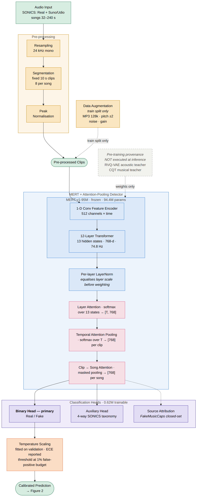
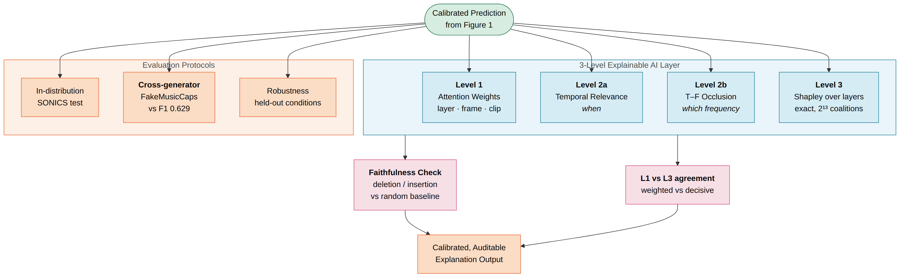

# Corrected architecture

These replace the diagram in `Research Architechture - 2343031.pdf`, which has
three blocking errors — see [`architecture-review.md`](architecture-review.md)
for what was wrong and how each was confirmed against the real checkpoint.

Sources are Mermaid (`figures/*.mmd`), the same format as the original, and
render with:

```bash
npx @mermaid-js/mermaid-cli -i docs/figures/architecture.mmd \
    -o docs/figures/architecture.svg -b white
```

SVG for LaTeX, PNG for slides. Split into two figures rather than one: the
original packed the model and the explainability layer into a single square that
was hard to read at page size, and the two are discussed in different sections
anyway.

---

## Figure 1 — Detector



**Caption.** Frozen MERT-v1-95M (94.4M parameters) feeds a 0.62M-parameter
trainable tail. All 13 hidden states are normalised per layer, weighted by
attention, pooled over frames, then pooled over the clips of a song. The binary
head is primary and is what the cross-generator result is reported from; the
4-way SONICS taxonomy is auxiliary and source attribution is scoped to
FakeMusicCaps. Temperature scaling is fitted on validation, and the operating
threshold comes from a false-positive budget rather than a 0.5 cut.

What changed from the original:

| Change | Why |
|---|---|
| RVQ-VAE and CQT teachers moved out of the inference path, shown dashed | They are pre-training targets. The released checkpoint contains no teacher modules — nothing there is executable. |
| **Clip → Song Attention added** | SONICS songs run 32–240 s; MERT is a 5 s model at 74.8 Hz with O(T²) attention. Audio must be segmented, and without a song-level stage the outputs are per-clip while the baselines are per-song. |
| "Layer-wise Feature Alignment" → **Per-layer LayerNorm** | The 13 states are already `[T, 768]`; nothing needs geometric alignment. Layer *scales* differ enough that the attention softmax would track magnitude instead of informativeness. |
| Frame Attention and Feature Fusion removed | Frame and temporal attention are the same axis — MERT frames *are* time frames — and Feature Fusion had a single input. |
| Self-Attention Aggregation removed from the default path | It sits between two stages that already mix across time. Retained as an ablation (`configs/experiment/self_attn_on.yaml`) so it must earn its parameters. |
| **Temperature scaling added** | The original labelled its output "Calibrated" but had no calibration stage. |
| Augmentation marked train-split-only | Augmenting val/test leaks the training distribution into the numbers meant to measure generalisation. |

---

## Figure 2 — Explainability and evaluation



**Caption.** Level 2 is split because Grad-CAM cannot deliver frequency
localisation on this model: MERT consumes raw waveform and its conv stack emits
512 channels × time, with no frequency axis in the forward pass. Level 2a takes
gradients there and localises *when*; level 2b perturbs in the STFT domain and
resynthesises, which is what can actually support a claim about *which
frequency*. Every explanation is scored against a random-masking baseline before
it is trusted — the gap is the result, since masking any audio degrades a
detector somewhat. Levels 1 and 3 are contrasted rather than summed: attention
weights are what the model allocates, Shapley values are what moved a given
decision, and disagreement between them is a finding.

Note the robustness conditions are disjoint from training augmentation by
construction (`aimd.data.perturb.assert_disjoint`), so that row measures
generalisation rather than memorisation.
